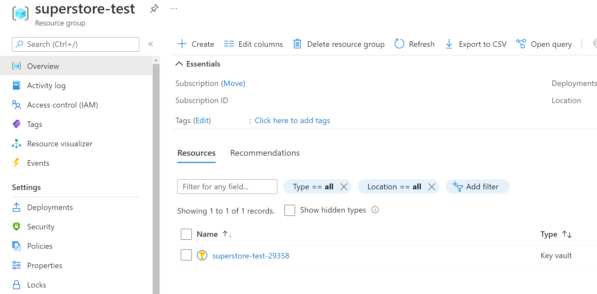
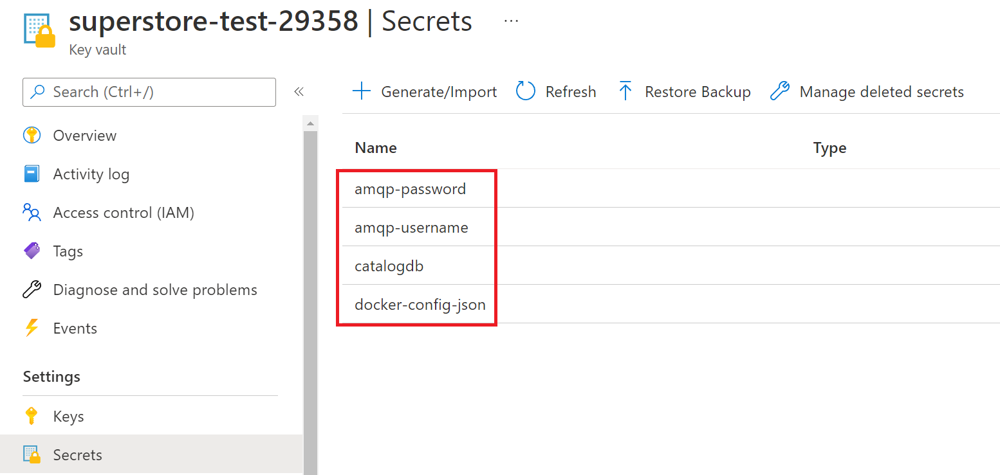

# Preparing Azure Resources

## Creating Azure KeyVault
We create a resource group and an Azure KeyVault which includes our credentials like database,amqp, 3rd app credentials.
You can change the variable values of `KV_RG`, `KV_NAME` or `LOCATION`. 
To prevent conflict `KV_NAME` ends with a random number.

```bash
KV_RG="superstore-test"
KV_NAME="superstore-test-$RANDOM"
LOCATION="westeurope"

az group create --name $KV_RG --location $LOCATION
az keyvault create --name $KV_NAME --resource-group $KV_RG --location $LOCATION
```

Created resource group and Azure KeyVault should look like the below after execution is completed.
<div style="margin:20px 0px 40px 0px;"></div>


## Creating Secrets on Azure KeyVault
Following commands will create three secrets in Azure KeyVault. First one (catalogdb) includes a dummy mssql connection string with all required parameters and it could be passed a SqlConnection object directly.

But, other secrets (amqp-username and amqp-password) only contain specific parameters of an amqp connection string. Therefore, these couldn't be passed directly to an application. For these two secrets, we will use **json path** support of operator to concatenate them.

```bash
az keyvault secret set --vault-name $KV_NAME --name "catalogdb" --value "Server=myServerAddress;Database=myDataBase;User Id=myUsername;Password=myPassword;"

az keyvault secret set --vault-name $KV_NAME --name "amqp-username" --value "adminusername"
az keyvault secret set --vault-name $KV_NAME --name "amqp-password" --value "secretpassword123"

az keyvault secret set --vault-name $KV_NAME --name "docker-config-json" --value '{"auths":{"srv":{"username":"usr","password":"pss","auth":"dXNyOnBzcw=="}}}'
```

<div style="margin:20px 0px 40px 0px;"></div>


<div class="ex-nav">
  <div class="left-nav">
    <a href="{{ '/example-use-case' | prepend: site.baseurl }}">
      << Use Case Scenario
    </a>
  </div>
  <div class="right-nav">
    <a href="{{ '/example-use-case/02-preparing-service-principal' | prepend: site.baseurl }}">
      Step 2 : Preparing Service Principal >>
    </a>
  </div>
</div>
<br>