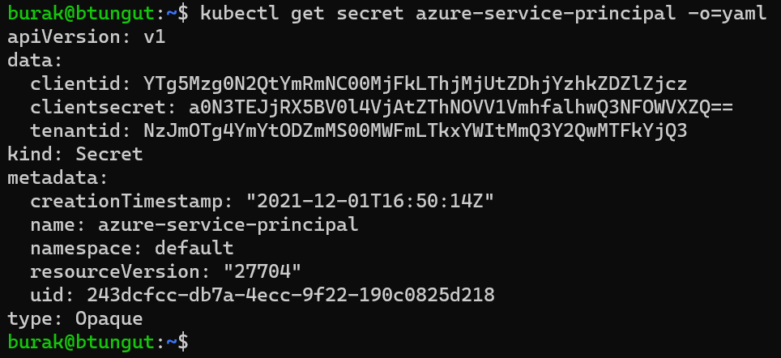

# Preparing Service Principal

## Creating Service Principal
Operator needs a Service Principal to get secrets from Azure KeyVault. By executing the following commands, you can create a service principal **without any assignment**.

Please edit the value of `SP_NAME` variable, if you want to change name of the service principal to be created.

```bash
SP_NAME="kubernetes-azure-keyvault-secret-operator"

#create service principal and get its secret (do not keep anywhere, it includes sensitive data!)
SP_CLIENTSECRET="$(az ad sp create-for-rbac --skip-assignment --name $SP_NAME --query 'password' -otsv)"

#get its appId/clientId
SP_CLIENTID="$(az ad sp list --display-name $SP_NAME --query '[0].appId' -otsv)"

#get tenantId of subscription
TENANTID="$(az account show --query 'tenantId' -otsv)"
```

## Authorizing for KeyVault
The service principal which is used by operator needs to have sufficient permission to get secrets from Azure KeyVault.
Following command provides a way to authorize the service principal to KeyVault both of created before.




```bash
az keyvault set-policy --name $KV_NAME --spn $SP_CLIENTID --secret-permissions get
```

## Creating Service Principal Secret
Until now, you created service principal and authorized it to KeyVault. Before operator is installed, you need to create a kubernetes secret which will be used by operator.

You can change `SECRET_NS` and `SECRET_NAME` variables which represents namespace and name of to be created secret.
```bash
SECRET_NS="default"
SECRET_NAME="azure-service-principal"

kubectl create secret generic $SECRET_NAME \
  --from-literal=clientid=$SP_CLIENTID \
  --from-literal=clientsecret=$SP_CLIENTSECRET \
  --from-literal=tenantid=$TENANTID \
  --namespace $SECRET_NS
```

<div style="margin:20px 0px 20px 0px;"></div>

<div class="ex-nav">
  <div class="left-nav">
    <a href="{{ '/example-use-case/01-preparing-azure-resources' | prepend: site.baseurl }}">
      << Step 1 : Preparing Azure Resources
    </a>
  </div>
  <div class="right-nav">
    <a href="{{ '/example-use-case/03-deploying-operator' | prepend: site.baseurl }}">
      Step 3 : Deploying Operator >>
    </a>
  </div>
</div>
<br>